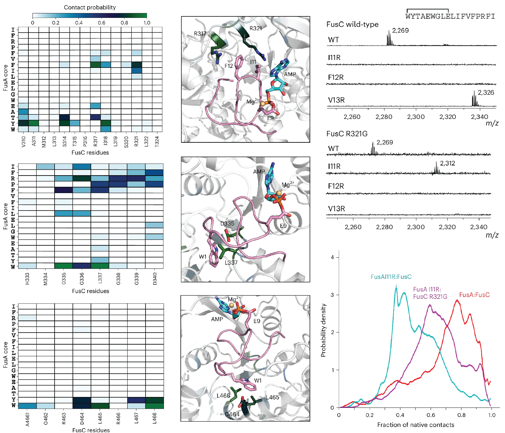

# Substrate Interactions Guide Cyclase Engineering and Lasso Peptide Diversification

<p align="center">
  
</p>

<p align="center">
  <a href="https://www.nature.com/articles/s41589-024-01727-w">Nature Chemical Biology Paper</a> | <a href="https://doi.org/10.5061/dryad.fttdz092h">Data Repository</a>
</p>

---

## Table of Contents

- [Abstract](#abstract)
- [Software Requirements](#software-requirements)
- [MD Simulation Data](#md-simulation-data)
  - [System Nomenclature](#system-nomenclature)
  - [Trajectory Files](#md-simulation-trajectories)
  - [Pairwise Residue Distances](#pairwise-residue-side-chain-heavy-distances)
- [Analysis](#analysis)
  - [Fraction of Native Contacts (Q)](fraction-of-native-contacts)
  - [Contact Probability](contact-probability)
  - [Q Probability Density](fraction-of-native-contacts-q-probability-density)
  - [Peptide Residue Contributions](peptide-residue-contributions-to-contact-probability)
- [Citation](#citation)

---

## Abstract

This repository contains molecular dynamics (MD) simulation data and analysis code for the manuscript [Substrate Interactions Guide Cyclase Engineering and Lasso Peptide Diversification](https://www.nature.com/articles/s41589-024-01727-w) published in *Nature Chemical Biology*. We performed extensive MD simulations (50 μs per system) on five different FusA (Lasso Peptide Fusilassin) : FusC (Fusilassin Cyclase) complex systems to investigate substrate-enzyme interactions that guide cyclase engineering and enable lasso peptide diversification.

---

## Software Requirements

- **Python:** 3.7+
- **OpenMM:** 7.6.0
- **MDTraj:** 1.9.9

---

## MD Simulation Data

### System Nomenclature

Five systems were simulated, each representing different lasso peptide-enzyme variant combinations:

| System Name | Description | Run Index |
|-------------|-------------|-----------|
| **FusA_FusC** | FusA wildtype : FusC wildtype | RUN0 |
| **FusA_I11R_FusC** | FusA I11R : FusC wildtype | RUN1 |
| **FusA_I11R_FusC_R321G** | FusA I11R : FusC R321G | RUN2 |
| **FusA_V13R_FusC** | FusA V13R : FusC wildtype | RUN3 |
| **FusA_V13R_FusC_R321G** | FusA V13R : FusC R321G | RUN4 |


### MD Simulation Trajectories

**Simulation Details:**
- **Software:** OpenMM 7.6.0
- **Platform:** Folding@home
- **Force Field:** CHARMM36m
- **Total Time per System:** 50 μs
- **Trajectories per System:** 100 (500 ns each)
- **Frames per Trajectory:** 5,000

**Data Files:**

| File | Size | Description |
|------|------|-------------|
| `FusA_FusC.tar.gz` | 19.1 GB | RUN0: Wildtype system |
| `FusA_I11R_FusC.tar.gz` | 19.1 GB | RUN1: I11R peptide mutant |
| `FusA_I11R_FusC_R321G.tar.gz` | 19.1 GB | RUN2: I11R peptide + R321G cyclase |
| `FusA_V13R_FusC.tar.gz` | 19.1 GB | RUN3: V13R peptide mutant |
| `FusA_V13R_FusC_R321G.tar.gz` | 19.0 GB | RUN4: V13R peptide + R321G cyclase |

**Archive Contents:**
- 1 topology file (`.parm7`) - CHARMM36m force field parameters
- 100 trajectory files (`.xtc`) - Named as `RUN[index]_CLONE[index]_traj.xtc`


### Pairwise Residue Side Chain Heavy Distances

Pairwise side chain heavy atom distances between FusA and FusC were calculated to characterize substrate-enzyme interactions.

**Selection Criteria:**
- **FusC:** 112 residues within 8 Å of FusA in the active site
- **FusA:** All 18 residues

**Data Files:**

| File | Size | Description |
|------|------|-------------|
| `FusA_FusC_res_dist.tar.gz` | 17.7 GB | Distance matrices for all 5 systems |

**Analysis Code:** [`Pairwise_residue_distances.py`](https://github.com/ShuklaGroup/lasso_rotaxane/blob/main/Pairwise_residue_distances.py)

---
## Analysis

### Fraction of Native Contacts

The fraction of native contacts (Q) quantifies peptide pre-folding and structural stability.

**Data Files:**

| File | Size | Description |
|------|------|-------------|
| `FusA_FusC_Q.tar.gz` | 8.4 MB | Q values for all systems and frames |

**Analysis Code:** [`Native_Contacts.py`](https://github.com/ShuklaGroup/lasso_rotaxane/blob/main/Native_Contacts.py)


### Contact Probability

Contact probability represents the likelihood of residue pairs exhibiting side chain heavy atom distances < 5 Å in frames where peptide Q > 0.8.

**Data Files:**

| File | Size | Description |
|------|------|-------------|
| `FusA_FusC_contact_prob.tar.gz` | 18.8 kB | Contact probability matrices for all systems |

**Analysis Code:** [`Contact_probability_heatmap.py`](https://github.com/ShuklaGroup/lasso_rotaxane/blob/main/Contact_probability_heatmap.py)


### Fraction of Native Contacts Probability Density

Fraction of Native Contacts (Q) probability density distributions characterize the conformational landscape of the peptide substrate.

**Data Files:**

| File | Size | Description |
|------|------|-------------|
| `FusA_FusC_Q_prob_density.tar.gz` | 13.9 kB | Probability density data (bins, mean, SD) |

**Analysis Code:** [`Native_Contacts_prob_density.py`](https://github.com/ShuklaGroup/lasso_rotaxane/blob/main/Native_Contacts_prob_density.py)


### Peptide Residue Contributions to Contact Probability

Individual FusA residue contributions were calculated by summing contact probabilities with all selected FusC residues and normalizing.

**Data Files:**

| File | Size | Description |
|------|------|-------------|
| `FusA_FusC_pep_res_contributions.tar.gz` | 1.0 kB | Contribution values for all systems |

**Analysis Code:** [`Contact_probability_contribution.py`](https://github.com/ShuklaGroup/lasso_rotaxane/blob/main/Contact_probability_contribution.py)

---

## Citation

If you use this data or code in your research, please cite:

```bibtex
@article{Barrett2024,
  title = {Substrate interactions guide cyclase engineering and lasso peptide diversification},
  volume = {21},
  ISSN = {1552-4469},
  url = {http://dx.doi.org/10.1038/s41589-024-01727-w},
  DOI = {10.1038/s41589-024-01727-w},
  number = {3},
  journal = {Nature Chemical Biology},
  publisher = {Springer Science and Business Media LLC},
  author = {Barrett,  Susanna E. and Yin,  Song and Jordan,  Peter and Brunson,  John K. and Gordon-Nunez,  Jessica and Costa Machado da Cruz,  Gabriella and Rosario,  Christopher and Okada,  Bethany K. and Anderson,  Kelsey and Pires,  Thomas A. and Wang,  Ruoyang and Shukla,  Diwakar and Burk,  Mark J. and Mitchell,  Douglas A.},
  year = {2024},
  month = sep,
  pages = {412–419}
}
```

---

## License

*Add your license information here (e.g., MIT, GPL, CC-BY)*

---